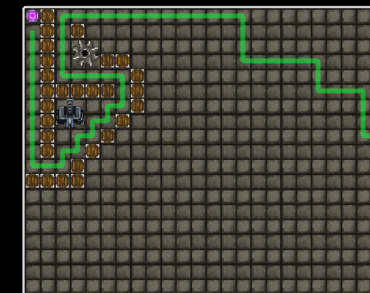
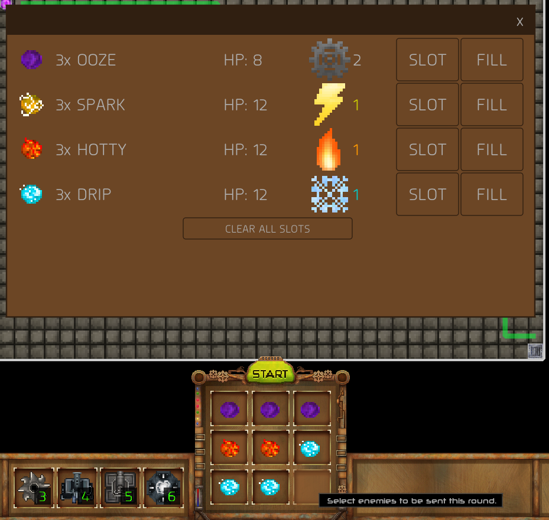
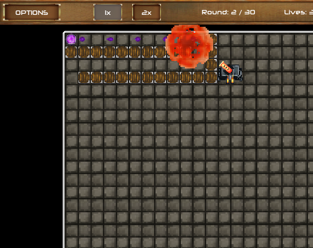
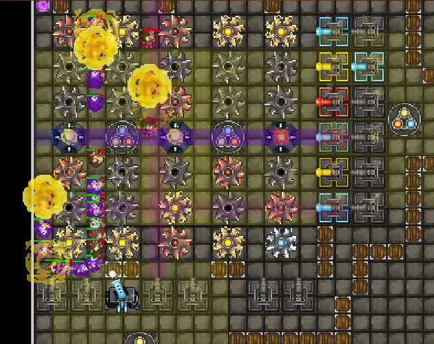

# Bloboratory - Game Off 2018

Collaborative entry for [GitHub Game Off 2018](https://itch.io/jam/game-off-2018) with the theme `'Hybrid'`.

A tower defense game where YOU pick the enemies that will put your maze of towers to the test. Combine resources from slain foes to upgrade your towers and prepare for fearsome bosses!

## Team

* [Tom Smallridge](https://github.com/sundowns) - Developer
* [Max Chapman](https://github.com/chappos) - Developer
* [Savannah Hoskins](https://www.facebook.com/artofsavannah/) - Artist
* [Joshua Marks]() - Audio Wizard

## Controls

| Key        | Action           |
| ------------- |:-------------:|
| mouse1      | select/deselect structures |
| 1 - 6 | Place a structure |
| r | Rotate selected structure |
| x | Refund selected structure |

## Screenshots

### Place structures in a maze to determine the enemy path

### Fill up the crucible with the enemies you will face each round

### Use gathered resources to upgrade your towers

### Strategise to defeat the tough bosses every fifth round

